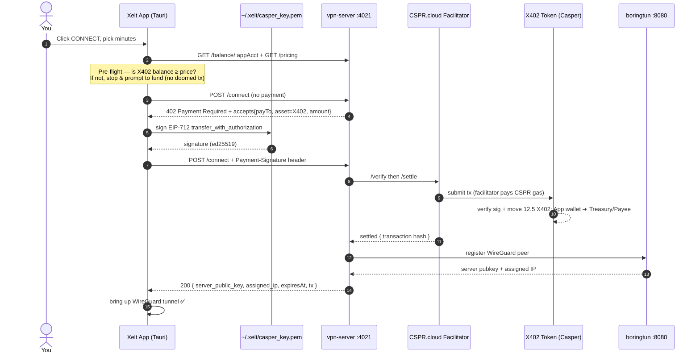
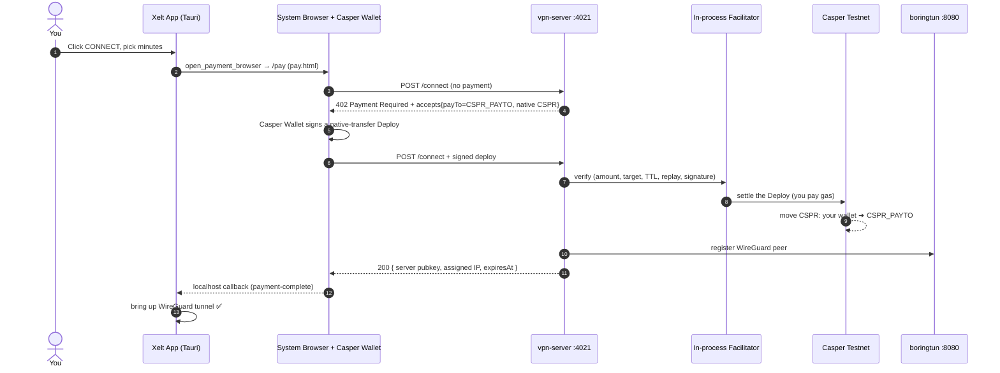

<div align="center">

# Xelt

### Pay-per-minute VPN, settled on Casper.

No accounts. No subscriptions. No signup.
Pay a micro-amount with the [x402](https://x402.org) HTTP-payment protocol and get an
encrypted **WireGuard** tunnel for exactly the minutes you bought.

`x402` · `Casper` · `CEP-18` · `WireGuard` · `Tauri`

</div>

---

## Why Xelt

Traditional VPNs want an account, a card, and a monthly plan — even for ten minutes at
an airport. Xelt removes all of it:

- **🔑 No identity** — the payment *is* the auth. Nothing to log into.
- **⏱ Pay per minute** — buy 1 minute or 60. It auto-expires when the time is up.
- **🔗 On-chain & verifiable** — every session is a real transfer settled on Casper.
- **🔒 Real encryption** — a genuine WireGuard tunnel, not a proxy.

---

## Two payment modes

Xelt ships with **two** interchangeable x402 payment backends, selected with the
`PAYMENT_MODE` env var. The VPN half (WireGuard/boringtun) is identical in both.

| | **`cloud`** (default) | **`local`** |
|---|---|---|
| Token paid | **X402** (a CEP-18 token) | **native CSPR** |
| Who signs | The **app's own Casper key** (in-app) | Your **Casper Wallet** (system browser) |
| Signature type | EIP-712 `transfer_with_authorization` (gasless / meta-tx) | A native-transfer `Deploy` |
| Who pays gas | The **CSPR.cloud facilitator** (relayer) | **You** (the signer) |
| Facilitator | Hosted [x402-facilitator.cspr.cloud](https://x402-facilitator.cspr.cloud) | In-process (`LocalFacilitatorClient`) |
| Money goes to | `PAYEE_ADDRESS` | `CSPR_PAYTO` |
| Set with | `PAYMENT_MODE=cloud` | `PAYMENT_MODE=local` |

> **The short version:** in **cloud** mode the app is a tiny self-custodial wallet that
> signs *gasless* X402 authorizations, and a facilitator relays them on-chain and pays
> the CSPR gas. In **local** mode you sign a normal CSPR transfer in your Casper Wallet
> and pay your own gas.

---

## The wallets & accounts

There are three Casper accounts (plus the facilitator) in play. All are **Testnet**.

| Role | Account (public key) | Used in | Explorer |
|------|----------------------|---------|----------|
| 💳 **App wallet** — the *payer*, holds X402 to spend | `01e02614…4791ff66` <br/> hash `c69aff…9ea1d` | cloud | [account ↗](https://testnet.cspr.live/account/01e02614d2916c2aaa6f986d857c1609c9b46d670e2afe838f70dfc6474791ff66) |
| 🏦 **Treasury / Payee** — mints + **receives** VPN payments | `012bc40f…2d11efa5` <br/> hash `5aa260…8d9a61` | cloud | [account ↗](https://testnet.cspr.live/account/012bc40fee1d05fc7f8c40cda65bf6298d5336ef50bfb2e305d0d13cc72d11efa5) |
| 💧 **Payee (native CSPR)** — receives CSPR | `020332de…ec74d93f` | local | [account ↗](https://testnet.cspr.live/account/020332def46c79fa31c3b2996fb8eb18c9d7a96510392b6f01a22561a1fcec74d93f) |
| 🤖 **Facilitator (CSPR.cloud)** — relays + pays gas | `0202b2d6…2e00032a3449` | cloud | run by CSPR.cloud |

> ### 👉 So what is "payTo"?
> In **cloud** mode, the account that receives your VPN payment is
> **`PAYEE_ADDRESS = 005aa260…8d9a61`**, whose public key is **`012bc40f…2d11efa5`**.
> In this demo that account is *also* the token treasury/deployer — i.e. the same
> account that mints X402 and funds the app wallet also collects the fares. In a real
> deployment you'd point `PAYEE_ADDRESS` at a separate revenue account.
>
> In **local** mode the payTo is **`CSPR_PAYTO = 020332de…ec74d93f`** and it receives
> **native CSPR**.

### Where the app wallet's private key lives

The cloud-mode app wallet is generated **inside the app** and stored on **your machine
only** — it is never in this repo and never sent anywhere.

```
~/.xelt/casper_key.pem       # app wallet (ed25519 PEM, chmod 600) — the payer
~/.xelt/x402-deployer.pem    # treasury/deployer key (holds the X402 mint)
```

- **Generated** by `casper-js-sdk` in the WebView — [`client/src/utils/casperKey.ts`](client/src/utils/casperKey.ts) (`loadOrCreateKey`).
- **Persisted** by Rust with `0600` perms — [`client/src-tauri/src/vpn.rs`](client/src-tauri/src/vpn.rs) (`write_casper_key_pem`), exposed as the `casper_key_read` / `casper_key_write` Tauri commands.

> ⚠️ **Hot wallet.** The key is an *unencrypted* PEM on disk — fine for a Testnet demo.
> For mainnet you'd want it encrypted / in the OS keychain, and a spending cap.

---

## The X402 token (CEP-18)

Cloud mode pays in a purpose-deployed CEP-18 token that supports the x402
`transfer_with_authorization` extension.

| Field | Value |
|-------|-------|
| Name / Symbol | Casper X402 Token · **X402** |
| Decimals | `9` |
| Initial supply | `1,000,000` X402 (minted to the treasury at install) |
| Package hash | [`251dd969…605ea98e`](https://testnet.cspr.live/contract-package/251dd9698092ad08cb01b859beeb8dd0c7cc7a1699316c1e89e7783b605ea98e) |
| Contract hash | `b854c1f2…17ceace2` |
| Price | `2.5 X402` / minute → a 5-min session = **12.5 X402** |

---

## How it works — **cloud mode** (default)

Cloud mode is a **gasless meta-transaction** (EIP-3009 "transfer with authorization"
style): the app *signs* an authorization but never touches the chain; the facilitator
submits it and pays gas. The app wallet therefore needs **X402 tokens, not CSPR**.



**Money flow:** `App wallet ──12.5 X402──▶ Treasury/Payee` (gas paid by the facilitator).

Wiring: client [`x402Vpn.ts`](client/src/utils/x402Vpn.ts) `vpnConnectWithPaymentCloud` →
`createCloudX402Fetch` (registers `@make-software/casper-x402` `ExactCasperScheme`);
server [`vpn-server/index.ts`](vpn-server/index.ts) registers the matching scheme + the
`HTTPFacilitatorClient`.

---

## How it works — **local mode**

Local mode is the original flow: you sign a **native CSPR transfer** in the **Casper
Wallet** browser extension (which can't inject into the Tauri WebView, so signing opens
in your system browser and the result comes back over a localhost callback).



**Money flow:** `Your Casper Wallet ──12.5 CSPR──▶ CSPR_PAYTO` (you pay gas).

Wiring: client `vpnConnectWithPayment` → `createX402Fetch` (`x402-casper`
`ExactCasperScheme`); Rust [`callback.rs`](client/src-tauri/src/callback.rs)
`open_payment_browser`; server uses `LocalFacilitatorClient`.

---

## System architecture (both modes)

```
                          PAYMENT LAYER (swappable)
   ┌───────────────────────────────────────────────────────────────────┐
   │  cloud:  App key ─sign EIP-712─▶ vpn-server ─▶ CSPR.cloud ─▶ Casper │
   │  local:  Casper Wallet ─sign deploy─▶ vpn-server ─▶ in-proc ─▶ Casper│
   └───────────────────────────────────────────────────────────────────┘
                                    │  on success: register peer
                                    ▼
   ┌─────────────────┐   WireGuard peer cfg   ┌──────────────────────┐
   │    Xelt App     │ ─────────────────────▶ │   vpn-server :4021    │
   │     (Tauri)     │ ◀───────────────────── │   /connect /renew ... │
   └────────┬────────┘   server pubkey + IP   └──────────┬───────────┘
            │                                             │ POST /v1/register
            │        WireGuard tunnel (UDP :51820)        ▼
            └────────────────────────────────▶ ┌──────────────────────┐
                                               │   boringtun  :8080   │
                                               │   WireGuard server   │
                                               └──────────────────────┘
```

---

## Live on-chain examples

Real Testnet transactions from this project — click through on
[testnet.cspr.live](https://testnet.cspr.live):

| What | Result | Link |
|------|--------|------|
| Treasury funds the app wallet (`200 X402`, plain CEP-18 `transfer`) | ✅ settled | [`667b3014…1779ecca`](https://testnet.cspr.live/transaction/667b3014e2a549a75d176f9746fba97be530e2645795728c04869e1a1779ecca) |
| A `/connect` payment **before** the app wallet was funded | ❌ `User error: 60001` (InsufficientBalance) | [`1c43a7b1…5566b995`](https://testnet.cspr.live/transaction/1c43a7b13bca481700ee6621836aaf6310463f78927632083d5721b45566b995) |

> The failed one is the teachable case: the facilitator *did* put it on-chain and paid
> ~2.27 CSPR gas, but the token contract couldn't move 12.5 X402 out of an account
> holding **0**, so it reverted with `60001`. Funding the app wallet with X402 fixes it.

---

## Repo layout

```
xelt/
├── client/                  # Tauri desktop app (WebView UI + Rust core)
│   ├── src/utils/casperKey.ts   # app-managed Casper key (cloud mode)
│   └── src/utils/x402Vpn.ts     # x402 connect/renew + balance + errors
├── vpn-server/              # x402 resource server (/connect, /renew, /balance, /pricing)
│   ├── services/tokenBalance.ts # CEP-18 X402 balance lookup (node RPC)
│   └── scripts/             # deploy-token, fund, balance-check, PoC settle/verify
├── packages/x402-casper/    # x402 scheme for native CSPR (local mode)
├── protocol/boringtun/      # WireGuard server (Rust, chain-agnostic)
├── server/                  # Docker deploy (optional)
└── docs/                    # CASPER_NOTES.md · X402_IMPLEMENTATION_GUIDE.md
```

---

## Quickstart

### Prerequisites

- **Rust** + **Node**; `brew install wireguard-tools` recommended on macOS.
- Cloud mode: nothing to install for the user — the app makes its own wallet.
- Local mode: the **Casper Wallet** extension + a Testnet account funded from the
  [faucet](https://testnet.cspr.live/tools/faucet).

### Run it — three terminals

**Terminal 1 · WireGuard server (boringtun)** — from the repo root:

```bash
cargo build --release --features payment -p boringtun-cli
sudo WG_SUDO=1 BT_PAYMENT_SERVER=0 BT_REGISTRATION_API=1 \
  BT_HTTP_BIND=0.0.0.0:8080 BT_PUBLIC_IP=127.0.0.1 BT_WG_PORT=51820 \
  WG_LOG_LEVEL=info ./target/release/boringtun-cli utun --foreground
# verify:  curl http://127.0.0.1:8080/health
```

**Terminal 2 · x402 payment server**

```bash
cd vpn-server
cp .env.x402cloud.example .env    # cloud mode (default). See Configuration below.
npm install
npm run dev
# verify:  curl http://127.0.0.1:4021/health
```

**Terminal 3 · desktop client**

```bash
cd client
cp .env.example .env.local        # VITE_SERVER_IP=127.0.0.1, VITE_PAYMENT_MODE=cloud
npm install
npm run tauri dev
```

Click **CONNECT** → choose minutes → (cloud) it pays in-app / (local) approve in Casper
Wallet → the tunnel comes up. ✅

### Fund the app wallet (cloud mode — do this once)

Cloud mode pays in X402, so the app wallet needs X402 first. Its address is shown in the
app's wallet bar; fund it from the treasury:

```bash
cd vpn-server
# transfer 200 X402 from the treasury/deployer to the app wallet
npx tsx scripts/deploy-token.ts --fund 00<app-account-hash> 200
# check balances any time
node scripts/check-x402-balance.mjs
```

Deploy your **own** token instead of the demo one:

```bash
npx tsx scripts/deploy-token.ts            # prints the deployer address to fund with CSPR
npx tsx scripts/deploy-token.ts --deploy   # installs the CEP-18 X402 contract (~800 CSPR)
# put the printed ASSET_PACKAGE + PAYEE_ADDRESS into vpn-server/.env
```

---

## Configuration

### Cloud mode — `vpn-server/.env`

| Env var | Meaning |
|---------|---------|
| `PAYMENT_MODE` | `cloud` (default). |
| `PAYEE_ADDRESS` | `00`+64-hex account hash that **receives X402**. |
| `ASSET_PACKAGE` | 64-hex CEP-18 x402 token package hash. |
| `ASSET_DECIMALS` | Token decimals (`9`). |
| `FACILITATOR_URL` | Hosted facilitator (`https://x402-facilitator.cspr.cloud`). |
| `FACILITATOR_API_KEY` | CSPR.cloud API key (**secret** — keep out of git). |
| `CASPER_NODE_URL` | Testnet RPC (`https://node.testnet.casper.network/rpc`). |
| `PRICE_PER_MINUTE_CSPR` | Price per minute (default `2.5`, applied in X402 units in cloud mode). |

### Local mode — `vpn-server/.env`

| Env var | Meaning |
|---------|---------|
| `PAYMENT_MODE` | `local`. |
| `CSPR_PAYTO` | Casper account public key (hex) that **receives CSPR**. |
| `PAY_PAGE_BASE` | Where the browser-signing page is served (`http://localhost:1420` in dev). |

> **Native transfer floor:** Casper requires a minimum native transfer of **2.5 CSPR**
> (+ ~0.1 CSPR gas). The default `2.5`/min keeps even a 1-minute session a valid transfer.

### Ports

| Port | Service |
|------|---------|
| `4021` | x402 payment API |
| `8080` | boringtun peer registration |
| `51820/udp` | WireGuard |
| `1420` | client pay page (Vite, dev) |

---

## Troubleshooting

**`User error: 60001` on a payment** — CEP-18 `InsufficientBalance`. The app wallet
doesn't hold enough **X402**. Fund it (see above) and retry. The app now pre-flights the
balance and shows a clear "fund this account" message instead of settling a doomed tx.

**Check the app wallet's X402 balance**
```bash
cd vpn-server && node scripts/check-x402-balance.mjs
# or via the server:
curl http://localhost:4021/balance/00<app-account-hash>
```

**Force-stop the Tauri app**
```bash
pkill -f "target/debug/xelt"; pkill -f "target/release/xelt"; pkill -f "tauri dev"; pkill -f "vite"
# stubborn instance:  ps aux | grep -iE "xelt|tauri|vite" | grep -v grep   then  kill -9 <PID>
```

**Port `4021` already in use**
```bash
lsof -ti :4021 | xargs kill
```

---

## Notes

- **Same-machine dev** (`127.0.0.1`) is great for the full pay → tunnel flow. For real
  internet **egress**, run boringtun on a Linux VPS with IP forwarding + NAT (the Docker
  `entrypoint.sh` sets this up).
- For same-machine demos that keep your internet alive, run the client with
  `XELT_SPLIT_TUNNEL=1` — it brings up the tunnel without hijacking your default route.
- **Why sign in the browser (local mode)?** The Casper Wallet extension only injects into
  real browsers, not the Tauri WebView. Cloud mode sidesteps this entirely by signing with
  the app's own key. See [docs/CASPER_NOTES.md](docs/CASPER_NOTES.md).
- View any settled transaction at [testnet.cspr.live](https://testnet.cspr.live).
